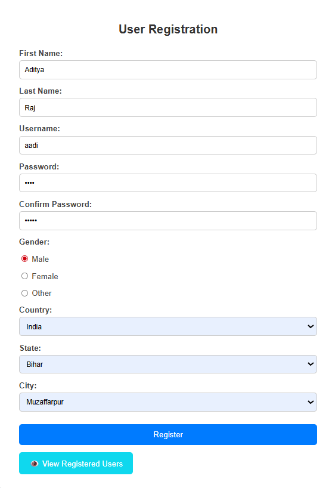
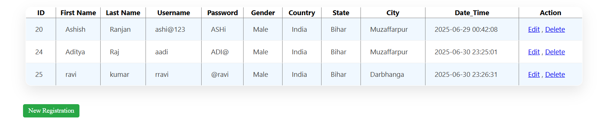
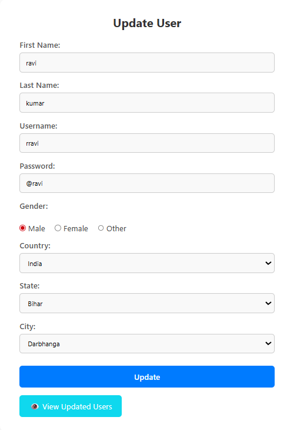

<h1 align="center">🧑‍💻 PHP User Registration & Management System</h1>

<p align="center">
  A lightweight and functional PHP + MySQL user registration system with full CRUD operations. Perfect for beginners and those looking to build authentication-based apps.
</p>

<p align="center">
  
  
  
  
</p>

---
## 📁 Project Files

- **Users.sql** – MySQL script to create the users table.
- **db_connect.php** – Handles the connection to the MySQL database.
- **register.php** – Registers new users.
- **data.php** – Fetches and displays all user data.
- **update.php** – Updates existing user details.
- **delete.php** – Deletes a user from the database.
- 
---

## ✨ Features

- ✅ **Register** new users
- 📋 **View** all user data in a table
- ✏️ **Update** user records easily
- ❌ **Delete** unwanted users
- 🔐 Clean, structured PHP codebase
- ⚡ Instant database operations using MySQL

---
## 📸 Screenshots

Here are some previews of the application in action:

### 📝 Registration Page



---

### 📋 User List Page



---

### ✏️ Update User Page



---

### ❌ Delete Confirmation


## 🔧 Getting Started

### 📥 Clone This Repository
```bash
git clone https://github.com/Ashish-ashi/registration.git
cd registration
